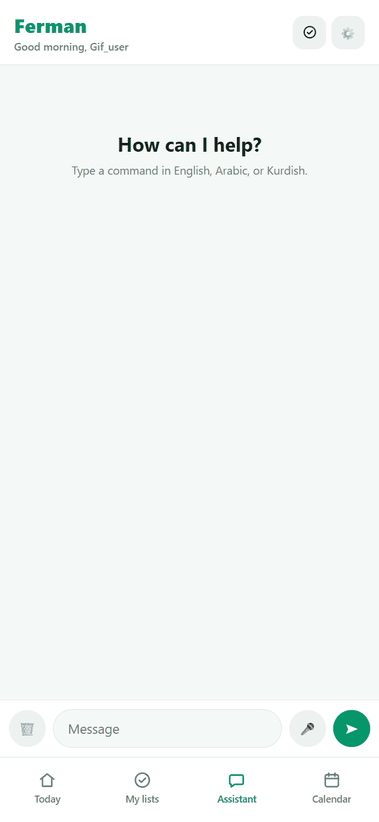
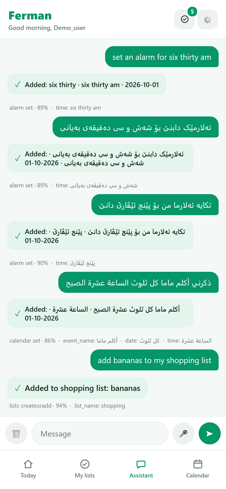
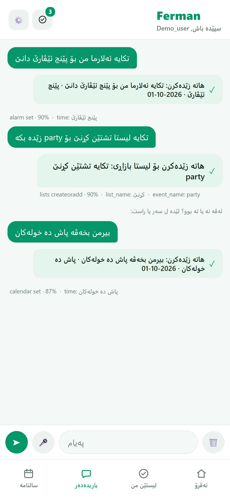
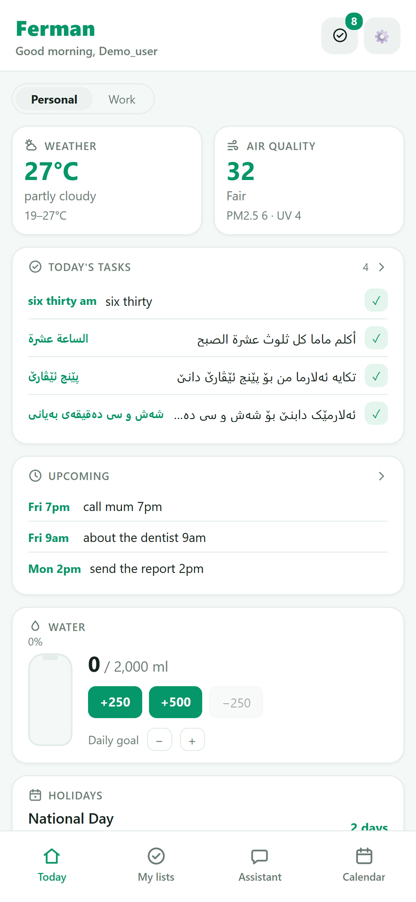
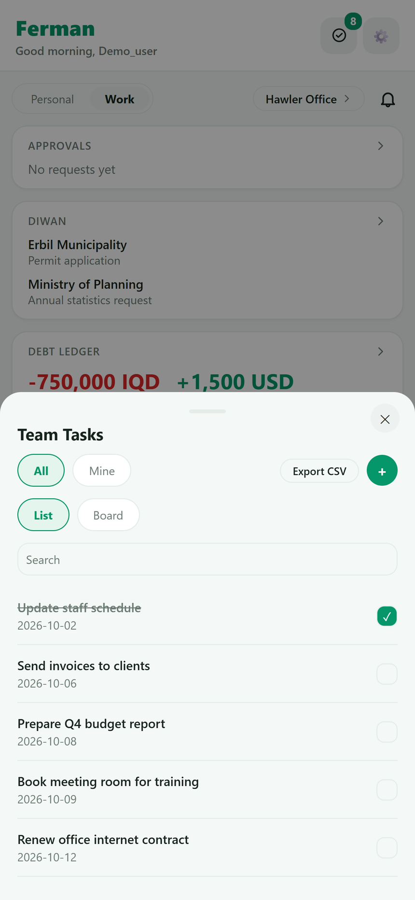

# Ferman — Multilingual Assistant for Iraq

A mobile-first assistant that understands commands in **English, Arabic, and
Kurdish (Sorani and Badini)** and acts on them: reminders, alarms, shopping
lists, a calendar, team tasks and more. It exists partly as an app and partly
as a **benchmark for intent and slot understanding in Iraqi and Kurdish
languages**, which are poorly covered by public NLU datasets.

## Screenshots



Each reply shows what the model understood: intent, confidence and the slots it
extracted, here for Badini and Sorani commands.

| Four languages | Kurdish interface | Daily feed | Team tasks |
|:---:|:---:|:---:|:---:|
|  |  |  |  |

More in [docs/screenshots/](docs/screenshots/): Arabic interface, calendar, work
dashboard, task board. Screenshots use fictional demo data.

## Results

Fine-tuned XLM-RoBERTa models, evaluated on the held-out test split of
`data/XLMR_dataset_4lang_v2.csv` (34 intents). Full output in
[ml/results/eval_results_v2.txt](ml/results/eval_results_v2.txt).

| Language | Test rows | Intent accuracy | Intent macro-F1 | Slot F1 |
|---|---:|---:|---:|---:|
| English | 1954 | 0.887 | 0.847 | 0.816 |
| Arabic | 1954 | 0.823 | 0.761 | not measured* |
| Badini | 370 | 0.719 | 0.682 | 0.623 |
| Sorani | 370 | 0.697 | 0.647 | 0.643 |
| **Overall** | | **0.832** | **0.790** | **0.769** |

\*The test split has no Arabic slot-annotated rows (all 304 are in train), so
Arabic slot extraction is unmeasured. Kurdish test sets are small (370 rows
each), so those figures carry wide uncertainty. Sorani is the weakest language
and the only one v2 did not improve over v1.

Models: [`OmarSY11/xlmr-intent-v2`](https://huggingface.co/OmarSY11/xlmr-intent-v2),
[`OmarSY11/xlmr-slot-v2`](https://huggingface.co/OmarSY11/xlmr-slot-v2).

## Architecture

- **Front-end:** `mobile/` — React Native (Expo, TypeScript). Runs on iOS,
  Android and web.
- **Back-end:** `backend/` — FastAPI (`main.py`). `POST /parse` returns the predicted
  intent and slots; also auth, per-user state sync, shared workspaces
  (`backend/workspace_routes.py` / `workspace.py`: diwan, debt ledger, tasks with checklists, approvals,
  notifications) and news/holiday feeds (`feeds.py`). Serves the web build from `backend/static/`.
- **Models:** two fine-tuned XLM-RoBERTa models (intent classification and
  slot tagging), loaded from the Hugging Face Hub at startup. If they are not
  found, a small keyword parser is used so the app still runs.
- **Data:** `data/` — the dataset and its [card](data/DATASET_CARD.md).
- **ML:** `ml/` — training notebooks, evaluation and augmentation scripts,
  results. See [ml/README.md](ml/README.md).

## Repository layout

```
backend/   FastAPI API, auth, workspaces, feeds, tests, requirements
mobile/    Expo / React Native app (iOS, Android, web)
data/      dataset CSVs, dataset card, v2 cleaning report
ml/        training notebooks, eval + augmentation scripts, results/
docs/      deployment, testing guide, screenshots
Dockerfile builds the backend (and the web build, if present)
```

## Run the backend

```bash
cd backend
pip install -r requirements.txt
uvicorn main:app --reload --host 0.0.0.0 --port 7860
```

`--host 0.0.0.0` matters if you want to test the mobile app on a physical
phone or the Android emulator — `127.0.0.1` there means the device itself,
not your computer.

## Run the mobile app

```bash
cd mobile
npm install
npx expo start
```

Then press `w` for a web preview, `a`/`i` for an Android/iOS simulator, or
scan the QR code with the **Expo Go** app on your phone.

### Pointing the app at the backend

The app reads `EXPO_PUBLIC_API_BASE_URL` for the FastAPI server's address.
Create `mobile/.env.local`:

```
EXPO_PUBLIC_API_BASE_URL=http://<your-computer's-LAN-IP>:7860
```

- Web preview / Android emulator talking to a server on the same machine can
  usually use `http://localhost:7860` (Android emulator: `http://10.0.2.2:7860`).
- A physical device (Expo Go or a dev build) must use your computer's LAN IP
  (e.g. `http://192.168.1.23:7860`), since `localhost` on the phone means the
  phone itself.

If `/parse` can't be reached at all, the app falls back to a small on-device
keyword parser, same as the original web prototype — so typing still works
even offline.

### What's implemented

Feed (weather, today's tasks, upcoming, shopping, prayer times, currency,
news), the assistant chat (with confidence/intent pills and tap-to-correct
candidates), the day/week/month/year calendar, Excel/CSV import, real local
notifications for reminders (via `expo-notifications`), theming (light/dark/
silver), and en/ar/ku UI language.

Voice input (the mic button in the composer) works **on the web build only**,
via the browser's Web Speech API — no key, no dependency. It needs Chrome,
Edge, Chrome on Android, or a recent Safari. Kurdish has no browser speech
model, so `ku` falls back to Iraqi Arabic (`ar-IQ`) recognition, since both
use Arabic script.

On native (Expo Go or a device build) the mic button doesn't render: real
on-device speech-to-text needs a native STT module that only works in a custom
EAS/dev-client build, so the native hook reports `supported: false`. See
`mobile/src/hooks/useVoiceInput.web.ts` and its native `.ts` counterpart.

## Tests

```bash
cd backend
pip install -r requirements.txt -r requirements-dev.txt
python -m pytest -q test_app.py
```

The tests download the XLM-R tokenizer from the Hub on first run.

## Deploying

See [docs/DEPLOY.md](docs/DEPLOY.md) — a Dockerfile is included and the container runs on
any host. Copy [.env.example](.env.example) for the configuration options.

## Notes

- Reminders, alarms and shopping lists are stored on the user's device; the
  server holds accounts, synced state and shared workspaces.
- Data collection for model improvement is **opt-in** per user (Settings).

## License and citation

Code: MIT ([LICENSE](LICENSE)). Dataset (`data/XLMR_dataset_4lang_*.csv`):
CC BY 4.0. The English and Arabic data derive from
[MASSIVE](https://github.com/alexa/massive) (Amazon, CC BY 4.0), which must be
credited; the Sorani and Badini rows are machine-translated additions. See
[data/DATASET_CARD.md](data/DATASET_CARD.md).

```bibtex
@misc{safar2026ferman,
  author = {Safar, Omar},
  title  = {Ferman: A Multilingual Intent and Slot Dataset for English, Arabic, Sorani and Badini},
  year   = {2026},
  note   = {https://github.com/omarGH99/ferman-ai-assistant}
}
```
